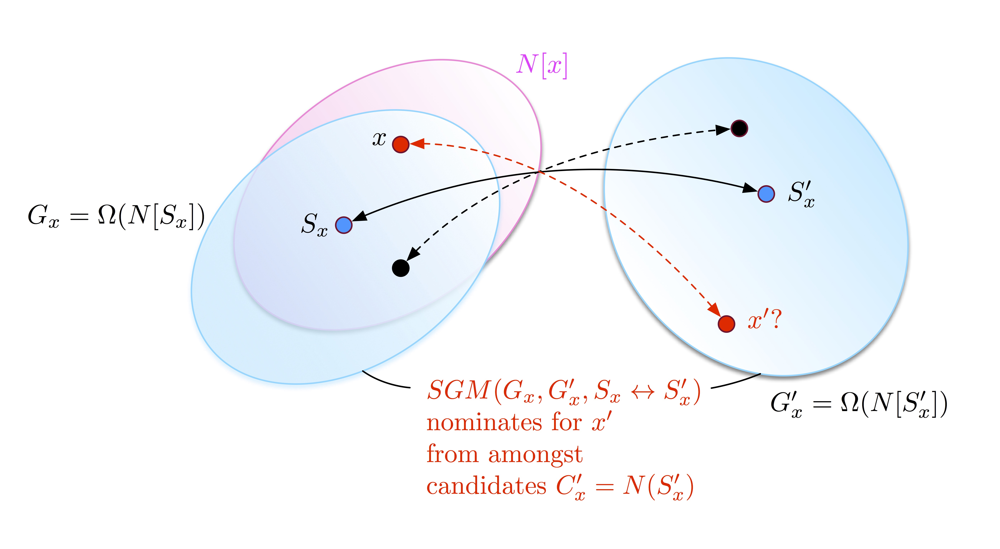

# Vertex Nomination via Seeded Graph Matching
Carey E. Priebe, Youngser Park, Heather Patsolic, Vince Lyzinski <br> Johns Hopkins University  


# Background

* The latest drafts of our papers are:

>    * Donniell E. Fishkind, Sancar Adali, Heather G. Patsolic, Lingyao Meng, Vince Lyzinski, C.E. Priebe, "[Seeded Graph Matching](https://arxiv.org/abs/1209.0367)," submitted, 2017. ([codes and plots](http://www.cis.jhu.edu/~parky/D3M/SGM/))
>    * Heather G. Patsolic, Youngser Park, Vince Lyzinski, C.E. Priebe, "[Vertex Nomination Via Local Neighborhood Matching](https://arxiv.org/abs/1705.00674)," submitted, 2017. ([codes and plots](http://www.cis.jhu.edu/~parky/D3M/VNSGM/))

* The slide sets are [here (long)](http://www.cis.jhu.edu/~parky/D3M/jhusna1705_fullHandout.pdf) and [here (short)](http://www.cis.jhu.edu/~parky/D3M/jhusna1705_shortHandout.pdf).

<figure>

</figure>

Here we describe our approach to both the simulations and the illustrative experiments, which allows the same code to be used to address a real problem in anger (when we don’t know any truth except the VOI $x$ and some seeds $S \leftrightarrow S'$).  
If it’s a simulation or illustrative experiment: (1) generate $G$ and $G'$ with some shared vertices and some unshared vertices, or start with real data $G$ and $G'$ with a collection of known shared vertices and some unknown or unshared vertices, and (2) randomly pick VOI $x$ and some number of seeds $S\leftrightarrow S'$ from amongst the shared vertices; then embark on our procedure described below. If it’s a real problem, with given VOI $x$ and some seeds $S \leftrightarrow S'$, then embark immediately on our procedure described below.

# `R` Package

The latest R source package can be installed via github as

```
require(devtools)
devtools::install_github("youngser/VN")
```

# Demo

A simulation as well as a real data experiment are provided as a `vignette` [document](VN/vignette/vn.pdf) in the package.
